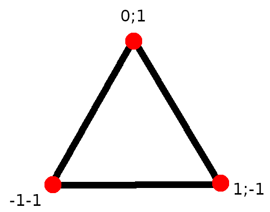

# Rendering

As you probably know to render graphics we use the GPU. What you may not know is _how_ the GPU can render graphics.
Rendering is done through some steps, each one processing the output of the previous one, this is what we call the **pipeline**.

In graphics we usually draw polygons starting with triangles since those are very simple and efficient to draw for a GPU, to draw a triangle we need 3 _vertices_ and we can represent a vertex with 3 positions since we are in a 3d space. So the first step is to pass the vertices positions to our pipeline.

Now we can go into the first step of the pipeline, the **vertex stage**, here we may want to change the position of each vertex to do things like transformations or projections. The output of the vertex stage is then sent to the shape assembly, here the GPU creates the triangle with the given positions and its output is then sent to the **rasterization stage**. In this stage the GPU checks which pixels are contained by the triangle so that they can be later colored in the **fragmentation stage**.

We usually control this behaviours using **shaders**. Shaders are programs written by us but instead of running on our CPU like other programs, shaders run on the GPU. Indeed we cannot write shaders in languages like Rust or C, we need to use a **shading language**. There are many shading languages out there like **GLSL**, **MSL**, **HLSL** and **WGSL**. **WGSL** is the de-facto shading language for wgpu and I'll use that in this book.

>**Note:** Wgpu also supports **SPIR-V** which is a specification made by the Khronos Group (the team behind OpenGL and Vulkan) so you can use any language which compiles to **SPIR-V** as shading language.
